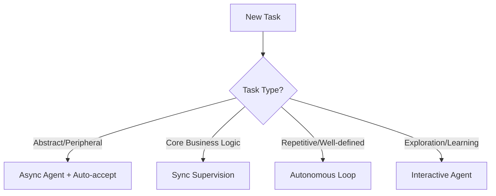

# 🎯 Anthropic's Suggested Agent System Analysis

**Previous:** N/A | **Next:** [BMAD System Analysis](./20250729-1430-bmad-system-analysis.md)
**Related:** [Agent Systems Comparison](./20250729-1500-systems-comparison.md)

---

## 📋 Request Checklist
What you asked for:
- ✅ What do you think Anthropic suggests as best agent system?
- ✅ Analysis of sub-agents__anthropic.md
- ✅ Analysis of how-anthropic-teams-use-claude-code__anthropic.md
- [ ] Integration with Memory CLAUDE.md
- [ ] Integration with MCP servers

## 🎯 Your Original Request
> What do you think anthropic suggest best agent system? in their docs

## 🧠 Core Philosophy: Context Preservation + Specialized Expertise

Based on the documentation, Anthropic's suggested agent system revolves around **four key principles**:

### 1. 🎨 Context Window Management
- **Primary benefit**: Each sub-agent operates in its own context window
- **Why it matters**: Prevents pollution of main conversation, keeps high-level objectives focused
- **Real impact**: Longer overall sessions, better performance on complex tasks

### 2. 🔧 Tool-Specific Permissions
- **Granular control**: Each agent only gets tools it needs
- **Security first**: Limit powerful tools to specific agent types
- **Example**: Code reviewer gets `Read, Grep, Glob, Bash` but not `Edit`

### 3. 📝 Declarative Configuration
- **Simple format**: Markdown files with YAML frontmatter
- **Two-tier system**:
  - `.claude/agents/` - Project-specific agents
  - `~/.claude/agents/` - User-level agents across projects
- **Inheritance**: Agents can inherit all tools or specify exact subset

### 4. 🚀 Proactive Delegation
- **Automatic invocation**: Based on task descriptions
- **Description-driven**: `description` field guides when to use
- **Magic phrases**: "use PROACTIVELY" or "MUST BE USED" in descriptions

## 📊 Best Practices from Anthropic Teams

### 🏗️ Architecture Patterns

#### 1. **Task Classification Matrix**


#### 2. **Agent Specialization Levels**
| Level        | Use Case                      | Example        | Autonomy |
| ------------ | ----------------------------- | -------------- | -------- |
| **Narrow**   | Single task, clear boundaries | test-runner    | High     |
| **Domain**   | Specific area expertise       | data-scientist | Medium   |
| **Workflow** | Multi-step processes          | code-reviewer  | Low      |
| **Meta**     | Agent coordination            | orchestrator   | Variable |

### 🎯 Real-World Usage Patterns

#### From Data Infrastructure Team:
- **Screenshot-driven debugging**: Feed UI screenshots for infrastructure issues
- **Plain text workflows**: Non-technical users describe workflows, Claude executes
- **End-of-session updates**: Claude summarizes and improves documentation

#### From Product Development Team:
- **Auto-accept mode**: `shift+tab` for autonomous prototyping
- **70% success rate**: Vim mode implementation mostly autonomous
- **Self-verification loops**: Build → Test → Fix automatically

#### From Growth Marketing:
- **Specialized sub-agents**: Separate agents for headlines vs descriptions
- **Memory systems**: Log hypotheses across iterations
- **API integration**: MCP servers for campaign analytics

## 🛠️ Recommended Implementation Structure

### 1. **Base Agent Template**
```markdown
---
name: agent-name
description: Use PROACTIVELY for [specific triggers]. MUST BE USED when [conditions].
tools: tool1, tool2, tool3  # Omit for all tools
color: 
---

You are a [role] specializing in [domain].

When invoked:
1. [First action]
2. [Second action]
3. [Verification step]

Key practices:
- [Specific instruction]
- [Quality standard]
- [Output format]

For each task:
- [Process step]
- [Deliverable]
- [Success criteria]
```

### 2. **Agent Hierarchy**
```
.claude/
├── agents/
│   ├── orchestrators/      # Meta-agents for coordination
│   ├── analyzers/          # Code/data analysis specialists
│   ├── builders/           # Implementation agents
│   ├── validators/         # Testing/review agents
│   └── operators/          # Infrastructure/deployment
└── CLAUDE.md               # Global instructions & agent guidelines
```

### 3. **Workflow Patterns**

#### **Pattern 1: Generator → Validator**
```
User Request → Generator Agent → Output → Validator Agent → Final Result
```

#### **Pattern 2: Analyzer → Builder → Tester**
```
Codebase → Analyzer Agent → Plan → Builder Agent → Code → Tester Agent → Verified
```

#### **Pattern 3: Parallel Specialists**
```
         ┌→ Frontend Agent →┐
Task → Orchestrator →→ Backend Agent  →→ Integration
         └→ Database Agent →┘
```

## 💡 Key Insights

### ✅ What Works Best:
1. **Start with Claude-generated agents** - Iterate to personalize
2. **Single responsibility principle** - One clear purpose per agent
3. **Detailed system prompts** - More guidance = better performance
4. **Checkpoint-heavy workflows** - Commit often for easy rollbacks
5. **Visual-first approach** - Screenshots > text descriptions

### ⚠️ Common Pitfalls: 
1. **Over-broad agents** - Trying to do everything
2. **Insufficient prompts** - Vague instructions lead to poor results
3. **Tool overload** - Giving unnecessary permissions
4. **Ignoring inheritance** - Not leveraging tool inheritance effectively

## 🚀 Anthropic's "Golden Path"

Based on all documentation, the ideal agent system:

1. **Uses `/agents` command** for easy management
2. **Leverages MCP servers** for external integrations
3. **Implements memory systems** via CLAUDE.md
4. **Creates agent chains** for complex workflows
5. **Maintains project/user separation** for reusability

## 📈 Success Metrics

Teams report:
- **2-4x time savings** on routine tasks
- **70% autonomous success** on well-defined tasks
- **10x creative output** with proper automation
- **Weeks → Hours** for complex coordination

## 🔮 Future Direction

Anthropic seems to be moving toward:
- **Deeper MCP integration** - More external tool access
- **Better agent coordination** - Meta-agents managing sub-agents
- **Enhanced memory systems** - Cross-session learning
- **Visual workflow builders** - GUI for agent creation

---

**Next Steps**: Analyze BMAD, contains-studio, Disler, and Denis systems to compare approaches