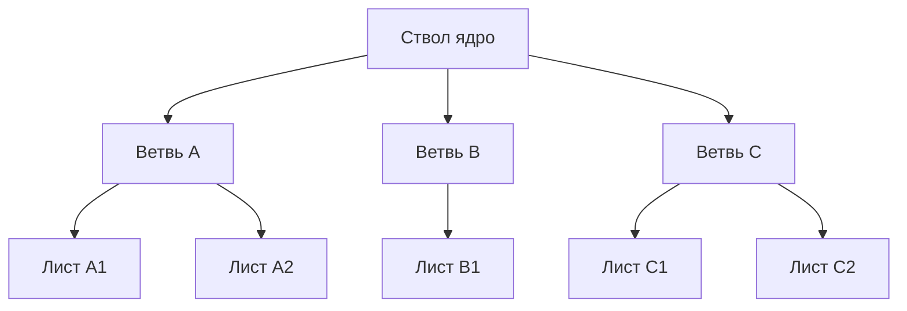
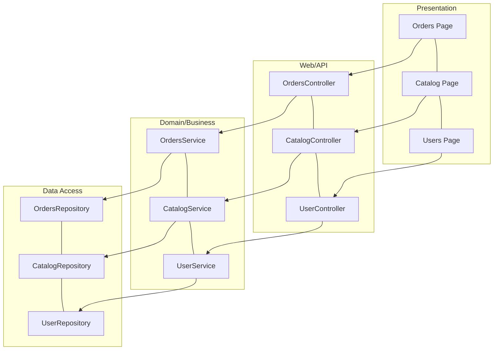
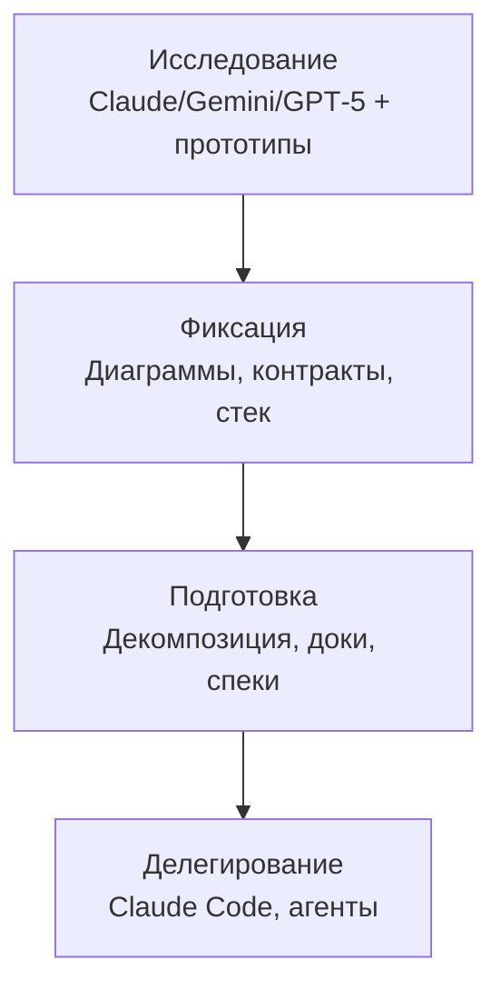
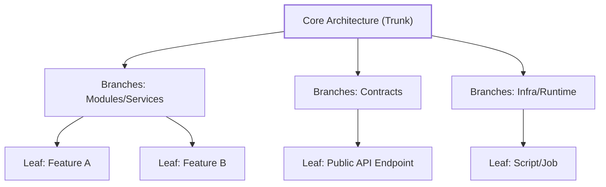
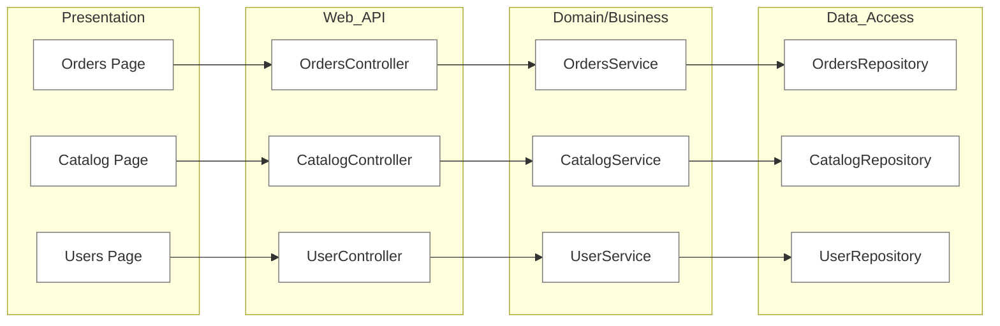
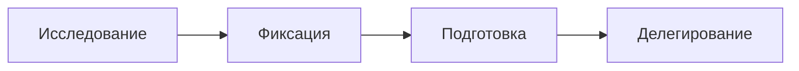

# Prompt 
Прочти трансрипт и мне нужно полноая версия слайдов .pdf в markdown,  
где уместные mermaid, tables сделай, я понимаю что в markdown мы не можем сделать иконки и некоторые разделители, но на самом деле даже emoji можно сделать и все в принципе можно сделать! Важно заголовками отделить слайды номер и заголовок и подзаголовки внутри слайда

# Gpt5 pro
## TL;DR

* Сделал **полную версию слайдов** в Markdown (19 слайдов) с таблицами и Mermaid‑диаграммами; готово к экспорту в PDF. **[Скачать .md](sandbox:/mnt/data/trees-leaves-agents.md)**. Основано на ваших слайдах; дополнил тезисами из SRT. 
* Включил ключевые диаграммы: **дерево (ствол/ветви/листья)**, **слоёная архитектура**, **workflow архитектора**; таблицы по **Waterfall**, **докам для агентов**, **NFR vs FR**.
* Для экспорта в PDF: `npx marp` или `pandoc` — команды ниже.

---

## Steps

1. Прочитал PDF + транскрипт (SRT), синхронизировал смысловые блоки.
2. Перенёс визуальные части в **таблицы** и **Mermaid** (tree, layers, workflow).
3. Сверстал «**Слайд N — Заголовок**» с подзаголовками и краткими заметками из SRT.
4. Сохранил как файл: **[trees-leaves-agents.md](sandbox:/mnt/data/trees-leaves-agents.md)**.
5. Экспорт в PDF (варианты):

   * **Marp (рекомендую для слайдов)**

     ```bash
     npx @marp-team/marp-cli /path/trees-leaves-agents.md --pdf -o deck.pdf
     ```
   * **Pandoc (для документ‑PDF)**

     ```bash
     pandoc /path/trees-leaves-agents.md -o deck.pdf --from gfm --pdf-engine=xelatex
     ```

---

## Ключевые слайды (смысл и trade‑offs)

| Slide                     | Why                               | What                                                          | How                                          | Trade‑offs                                    |
| ------------------------- | --------------------------------- | ------------------------------------------------------------- | -------------------------------------------- | --------------------------------------------- |
| 4. Метафора дерева        | Снизить системный риск            | Техдолг допустим в листьях, не в стволе                       | Изолируйте leaf‑компоненты                   | Быстрее фичи ↔ риск ядра при нарушении границ |
| 8. Waterfall возвращается | Агенты читают всё и следуют спеке | Водопад на ядре, Agile на листьях                             | «Спека → Реализация → Верификация»           | Больше upfront‑работы ↔ меньше сюрпризов      |
| 10. Слои/границы          | Избежать размытия ответственности | Presentation → API → Domain → Data                            | Контракты: интерфейсы, OpenAPI, Repo pattern | Чёткие границы ↔ больше boilerplate           |
| 11. Workflow архитектора  | Управлять скоростью и качеством   | Исследование → Фиксация → Подготовка → Делегирование          | Прототипы + диаграммы + спеки                | Время на фиксацию ↔ меньше дрейфа             |
| 12. Документы для агентов | Контекст должен быть релевантен   | ARCHITECTURE.md, DOMAIN.md, API_SPEC, CONVENTIONS, GUARDRAILS | Включать только нужное                       | Полнота ↔ объём контекста                     |
| 13. NFR vs FR             | Где держать контроль              | NFR — наша зона; FR — делегируем                              | Зафиксируйте NFR как «ствол»                 | Гибкость фич ↔ жёсткие NFR                    |

---

## Next actions

* ✅ Прогоните md → PDF (Marp/Pandoc).
* ✅ Добавьте проект‑специфичные **ADR** (используйте мини‑шаблон в конце файла).
* ✅ Примите «контракты для агентов»: какие файлы выдаём под задачу.
* ✅ Решите стратегию: **Waterfall для ядра**, **Agile для листьев**.
* ✅ Проставьте **NFR‑метрики** (RPS/latency/error budget) прямо в ARCHITECTURE.md.

---

## Полная версия слайдов (Markdown)


## Деревья, листья, слои и агенты — полная версия (Markdown)

> Основано на ваших слайдах и дополнено тезисами из транскрипта. Источник слайдов: :contentReference[oaicite:1]{index=1}

---

## Слайд 1 — Деревья, листья, слои и агенты
**Подзаголовок:** Как индустрия ИИ‑разработки повторяет путь классического software engineering  
**Автор:** @etechlead · **Дата:** 13 августа 2025

---

## Слайд 2 — Доклад Eric Schluntz «Vibe coding in prod» (Anthropic)
**Ключевые тезисы:**  
1) Будьте PM для ИИ.  
2) Думайте о «стволе» и «ветвях».  
3) Обеспечьте верифицируемость.  
4) Помните об экспоненте.

**Нота из транскрипта:** длина закрываемых задач агентами растёт экспоненциально; без границ и контрактов агенты «расползаются» по системе.

---

## Слайд 3 — Горизонт задач для LLM (METR)
- Увеличение продолжительности задач, которые LLM стабильно закрывает, ≈ удвоение каждые ~7 месяцев (метрика METR).  
- Следствие: растёт доля делегируемых «листовых» задач.

---

## Слайд 4 — Метафора дерева (техдолг в листьях vs в стволе)

**Принцип:**  
- Техдолг в листьях — **OK ✅** (локальный риск, легко заменить).  
- Техдолг в стволе — **Проблема ❌** (системный риск, дорогие переделки).




---

## Слайд 5 — История повторяется (Déjà vu)

**Быстрее в 10–100×:**

1. Функции → Программы → Продукты.
2. Ручные проверки → Автотесты.
3. Ручной деплой → CI/CD.
4. Спагетти‑код → Архитектура.
5. «Айтишники‑универсалы» → Разные роли.

**Новые техники:** Prompt engineering · Context engineering · Process engineering.

---

## Слайд 6 — Роль архитектора

**Меняется с ИИ:** скорость реализации (часы vs недели), масштаб делегирования (функции → сервисы), фокус на спецификациях.
**Остаётся:** ответственность за ядро, понимание бизнеса, управление сложностью.
*Это набор техник, а не догма.*

---

## Слайд 7 — Почему архитектура критична для агентов

**Проблемы без архитектуры:** дрейф контекста · несогласованность · галлюцинации в ядре · невозможный рефакторинг.
**Решение через архитектуру:** чёткие границы и контракты · фиксированное ядро · изолированные контексты · снижение зоны поражения и ошибок.

---

## Слайд 8 — Waterfall возвращается

**Почему «водопад» работает с ИИ:** агенты читают всё, точно следуют требованиям, их можно пересобрать с нуля.

|              | Люди 🙂                   | Агенты 🤖                  |
| ------------ | ------------------------- | -------------------------- |
| Документация | «Не хочу читать 100 стр.» | Прочитает всё              |
| Требования   | Творческая интерпретация  | Почти дословное следование |
| Процесс      | Выгорают, хэнд‑оффы       | Можно пересобрать заново   |

**Вывод:** 1) Детальная спека → 2) Реализация → 3) Верификация ✅

---

## Слайд 9 — Многоаспектная архитектура

**Срезы:** Системная (инфра, Docker, K8s) · Софтверная (модули, стили, паттерны) · Потоки данных (ETL, события, синхронизация).

**Типы контрактов:**

* Программные: интерфейсы, абстрактные классы, типы.
* API: OpenAPI/GraphQL/gRPC.
* Данные: JSON Schema/Protobuf.
* Инфраструктура: IaC (Terraform/Ansible/Docker).

---

## Слайд 10 — Слои, модули, границы



*Границы слоёв и ответственность модулей — обязательны; репозитории общаются с БД, контроллеры — нет.*

---

## Слайд 11 — Workflow архитектора



*Не уверены? Сделайте прототип.*

---

## Слайд 12 — Документы для агентов

> Контекст должен быть релевантным — включайте только нужное (и не показывайте всю систему).

| Документ        | + Ассеты                      | Когда включать      |
| --------------- | ----------------------------- | ------------------- |
| ARCHITECTURE.md | Mermaid‑диаграммы, интерфейсы | При интеграциях     |
| DOMAIN.md       | Domain classes, schema.prisma | Для модулей         |
| API_SPEC.yaml   | TypeSpec / OpenAPI            | Для endpoints       |
| CONVENTIONS.md  | Linter, fixer                 | Всегда (кратко)     |
| GUARDRAILS.md   | Что не трогать                | Запреты/ограничения |

---

## Слайд 13 — Нефункциональные vs Функциональные

**Наша зона ответственности (ствол и ветви):** производительность · архитектура · масштабируемость · безопасность.
**Зона агентов (листья):** CRUD‑операции · бизнес‑логика по спекам · валидация данных · юнит‑тесты.

> Ключевое: нефункциональные требования формируют «дерево». Функциональные — растут как «листья» на этом дереве.

---

## Слайд 14 — Если нет опыта (часть 1)

**Что спрашивать у ИИ для архитектурных решений:**

1. **Паттерны/практики:** «Какие паттерны подходят для [проблемы/контекста]?», «Плюсы/минусы [практики]».
2. **Решения:** «Какие ограничения по [NFR] и как их обеспечить?».
3. **Проверка/валидация:** «Какие риски?», «Где узкие места?».

**Пример хорошего вопроса:**

> «Система на 10k RPS, нужна реальная near‑real‑time обработка. Какие архитектурные подходы рассмотреть? Где будут bottlenecks?»

---

## Слайд 15 — Если нет опыта (часть 2)

**Фундаментальные книги:**

* *Patterns of Enterprise Application Architecture* — Fowler.
* *Domain‑Driven Design* — Evans.
* *Clean Architecture* — Martin.
* *Designing Data‑Intensive Applications* — Kleppmann.

**Практика:** System Design Interview · C4 Model (+Mermaid) · Twelve‑Factor App · ADR (Architecture Decision Records).

---

## Слайд 16 — Что дальше?

**Ближайшее будущее (6–12 месяцев):** большие контексты (1M+ токенов) · специализированные Agentic IDE · примеры/стандарты · фреймворки.
**Ваши действия сегодня:** документируйте и тестируйте · экспериментируйте с делегированием · делитесь опытом.

---

## Слайд 17 — Ключевые выводы

1. Эволюция идёт 10–100× быстрее.
2. Контролируйте ствол, делегируйте листья.
3. NFR — ваша зона (производительность/безопасность/масштаб).
4. Цель — снизить «зону поражения».
5. Архитектура — конкурентное преимущество (и защита от ошибок агентов).

---

## Слайд 18 — Вопросы и обсуждение

---

## Слайд 19 — Пример ADR (013): Выбор системы сообщений — Kafka

**Статус:** Принято · **Дата:** 2025‑08‑13

**Контекст**
Нужно обрабатывать события между микросервисами: высокая пропускная способность, гарантии доставки, масштабируемость.

**Решение**
Выбрать **Apache Kafka** как основную систему событийного обмена.

**Альтернативы**

* **RabbitMQ** — проще в администрировании, но хуже масштабируется по объёму событий.
* **NATS** — быстрый, но без встроённых гарантий доставки.

**Причины**
Поддержка нагрузки ~200k событий/с, экосистема (Kafka Streams/Connect), лёгкая масштабируемость.

**Последствия**
Больше требований к эксплуатации (DevOps), обучение команды работе с Kafka.

---

### Приложение — Мини‑шаблон ADR

```md
# ADR N: <Решение>
Дата: YYYY‑MM‑DD · Статус: Proposed/Accepted/Deprecated

## Контекст
<Коротко: проблема, ограничения, NFR.>

## Решение
<Одно решение. Коротко и конкретно.>

## Альтернативы
- <Вариант 1> — плюсы/минусы
- <Вариант 2> — плюсы/минусы

## Причины
<Почему выбрали это решение.>

## Последствия
<Что меняется в эксплуатации, риски, миграции.>
```

```

---

**Примечания к источнику:**  
- На *слайде 10* в оригинале показана слоёная схема (Presentation/Web‑API/Domain/Data Access); я перенёс её в Mermaid. :contentReference[oaicite:2]{index=2}  
- *Слайд 12* — таблица документов для агентов; перенесена 1:1. :contentReference[oaicite:3]{index=3}  
- *Слайд 19* — ADR про Kafka; адаптирован в Markdown‑формат. :contentReference[oaicite:4]{index=4}

Если нужно перевести этот Markdown в **reveal.js** или добавить фирменную тему (логотип, цвета), скажите — добавлю стиль и экспорт под ваш формат.
```


# Gpt5High 

**TL;DR**

* Перегнал PDF+транскрипт в “полный” Markdown-дек слайд-за-слайдом: пронумерованные заголовки, подзаголовки, таблицы, Mermaid-диаграммы.
* Где уместно — свернул схемы (дерево, слои, workflow) в Mermaid; текст подчистил, оставил тезисы без воды.
* Готов вставить в ваш репозиторий/SecondBrain как `*.md` и/или разрезать на отдельные слайды.

**Steps**

1. Прочитал транскрипт и PDF.
2. Сопоставил содержание и визуалы → нормализовал формулировки.
3. Добавил таблицы/диаграммы там, где в PDF были схемы/инфографика.
4. Сформировал “один файл — все слайды” (ниже).

**Quick stats**

| Item       | Кол-во |
| ---------- | -----: |
| Слайды     |     19 |
| Таблицы    |      6 |
| Mermaid    |      3 |
| ADR пример |      1 |

---

# Slide 1 — Деревья, листья, слои и агенты

### Подзаголовок

Как индустрия ИИ-разработки повторяет путь классического software engineering
Автор: **@etechlead** · Дата: **13 августа 2025**

---

# Slide 2 — Доклад Eric Schluntz (“Vibe coding in prod”, Anthropic)

### 4 тезиса

1. Будьте **PM для ИИ**.
2. Думайте о **стволе и ветвях**.
3. Обеспечьте **верифицируемость**.
4. Помните об **экспоненте**.

> Источник: презентация/видео Anthropic (“Vibe coding in prod”).

---

# Slide 3 — Экспонента (METR)

### Идея

Длина задач, которые LLM/агенты стабильно закрывают, **удваивается ~каждые 7 месяцев** (оценка METR).
Следствие: зона делегирования будет расти — игнорировать “vibe-coding” нельзя.

---

# Slide 4 — Метафора дерева

### Принцип

* Техдолг в **листьях** — допустим ✅
* Техдолг в **стволе** — больно/дорого ❌

### Диаграмма



---

# Slide 5 — История повторяется (Deja-vu)

### Сжатый путь индустрии (в 10–100× быстрее)

* Функции → Программы → Продукты
* Проверки руками → **Автотесты**
* Ручной деплой → **CI/CD**
* Спагетти-код → **Архитектура**
* “Универсальный айтишник” → **Роли**
* Новые техники: **Prompt / Context / Process engineering**

---

# Slide 6 — Роль архитектора

### Меняется с ИИ

* Скорость реализации (часы vs недели)
* Масштаб делегирования (функции → сервисы)
* Фокус на **спецификациях**

### Остаётся

* 🧭 Ответственность за **ядро**
* 🧠 Понимание бизнеса
* 🧩 Управление сложностью

---

# Slide 7 — Почему критично для агентов

### Проблемы без архитектуры

* Дрейф контекста
* Несостыковки модулей
* Галлюцинации в ядре
* Рефакторинг становится неэффективным

### Лечение архитектурой

* Чёткие **границы/контракты**
* Фиксированное **ядро**
* **Изоляция контекстов**
* **Снижение зоны поражения** от ошибок агента

---

# Slide 8 — Waterfall возвращается (в хорошем смысле)

### Люди vs Агенты (наблюдение)

| Критерий     | Люди                      | Агенты                      |
| ------------ | ------------------------- | --------------------------- |
| Документация | “Не хочу читать 100 стр.” | Проглотит всю               |
| Требования   | Творческая интерпретация  | Почти буквальное следование |
| Процесс      | Устают, выгорают          | Легко перегенерить заново   |

**Вывод:**

1. **Детальная спека** → 2) **Реализация** → 3) **Верификация** ✅

---

# Slide 9 — Многоаспектная архитектура

### Взглядов несколько

* **Системная:** инфра, контейнеры, k8s
* **Софтверная:** модули, слои, паттерны
* **Потоки данных:** ETL/Events/Sync

### Контракты

| Тип            | Чем описываем                     |
| -------------- | --------------------------------- |
| Программные    | Интерфейсы/абстракции/типы        |
| API            | OpenAPI / GraphQL / gRPC          |
| Данные         | JSON Schema / Protobuf            |
| Инфраструктура | IaC: Terraform / Ansible / Docker |

---

# Slide 10 — Слои, модули, границы

### Диаграмма (классическая 3/4-слойка)



---

# Slide 11 — Workflow архитектора

### Этапы

1. **Исследование:** Claude/Gemini/GPT-5 (DeepResearch), прототипы
2. **Фиксация:** диаграммы, контракты, стек
3. **Подготовка:** декомпозиция, документы, спеки
4. **Делегирование:** Claude Code, агенты
   *(Не уверен? Сделайте прототип!)*

### Диаграмма



---

# Slide 12 — Документы для агентов (и когда давать)

| Документ          | +Ассеты                         | Когда включать    |
| ----------------- | ------------------------------- | ----------------- |
| `ARCHITECTURE.md` | Mermaid, интерфейсы             | При интеграциях   |
| `DOMAIN.md`       | Domain classes, `schema.prisma` | Для модуля        |
| `API_SPEC.yaml`   | TypeSpec/OpenAPI                | Для endpoints     |
| `CONVENTIONS.md`  | Linter/Fixer правила            | Всегда (кратко)   |
| `GUARDRAILS.md`   | Что трогать нельзя              | Никогда не менять |

⚠️ **Контекст должен быть релевантным.** Включайте **только нужное**, не пихайте всю систему разом.

---

# Slide 13 — Нефункциональные vs Функциональные

### Наша зона (ствол+ветви)

* Производительность, масштабируемость
* Архитектура, безопасность
* Контракты и границы

### Зона агентов (листья)

* CRUD-операции
* Бизнес-логика по спекам
* Валидация данных
* Юнит-тесты

> Ключевое: **НФТ формируют дерево**, **ФТ** растут как листья на этом дереве.

---

# Slide 14 — Если нет опыта (ч.1): что спрашивать у ИИ

### Паттерны и практики

* “Какие паттерны применимы для {проблема} в {контекст}?”
* “Сравни подход X/Y по {критериям}.”
* “Покажи минимальную реализацию {паттерн}.”

### Архитектурные решения

* “Какая органицационная/функциональная декомпозиция?”
* “Какие средства обеспечат НФТ?”

### Проверка и валидация

* “Где могут быть бутылочные горлышки?”
* “Какие места стоит померить/смоделировать?”

**Пример хорошего вопроса:**
“У меня система на 10k RPS, требуется quasi-real-time. Какие архитектурные подходы рассмотреть и где будут bottlenecks?”

---

# Slide 15 — Если нет опыта (ч.2): что читать/на что ссылаться

### Фундамент

* Martin Fowler — *Patterns of Enterprise Application Architecture*
* Eric Evans — *Domain-Driven Design*
* Robert C. Martin — *Clean Architecture*
* Martin Kleppmann — *Designing Data-Intensive Applications*

### Практика

* *System Design Interview* (серия)
* **C4 Model** (+Mermaid)
* **The Twelve-Factor App**
* **ADR** (Architecture Decision Records)

---

# Slide 16 — Что дальше?

### Ближайшие 6–12 мес.

* **Большие контексты** (до 1M+ токенов)
* **Agentic IDE** (спец-среды для агентной разработки)
* **Примеры/стандарты** из комьюнити
* **Фреймворки** для типовых задач

### Ваши действия сегодня

1. Документируйте и тестируйте (архитектура, спеки, верификация).
2. Экспериментируйте с масштабом делегирования.
3. Делитесь опытом (ретроспективы, ADR, lessons learned).

---

# Slide 17 — Ключевые выводы

1. Эволюция идёт **10–100× быстрее**.
2. Контролируйте **ствол**, делегируйте **листья**.
3. **НФТ — ваша зона**; ФТ можно отдавать агентам.
4. Цель — **снизить blast radius** от ошибок.
5. Архитектура = **конкурентное преимущество**.

---

# Slide 18 — Вопросы и обсуждение

💬 Обсудим границы, охрану ядра, “enrich” контекста и метрики делегирования.

---

# Slide 19 — Пример ADR (решение: Kafka)

```markdown
# ADR 013: Выбор системы сообщений — Kafka
Дата: 2025-08-13
Статус: Принято

## Контекст
Нужен договорной обмен событиями между микросервисами: высокая пропускная,
гарантии доставки, масштабируемость.

## Решение
Использовать **Apache Kafka** как основную СШ.

## Альтернативы
- RabbitMQ — проще, но хуже масштабируется на пиковых объёмах.
- NATS — быстрый, но слабее экосистема и гарантийность доставки.

## Причины
- Поддержка объёмов ~200k событий/с.
- Лёгкая масштабируемость.
- Богатая экосистема (Streams/Connect).

## Последствия
- Больше DevOps-издержек (кластер, операционные практики).
- Требуется обучение команды работе с Kafka.
```

---

**Next actions**

1. Если нужно — сохраню это как `Trees-Leaves-and-Agents-Architecture.slides.md` в `/mnt/data` (или укажи путь к твоему SecondBrain).
2. Хочешь разбить на *отдельные* `slide-NN.md` с YAML-фронтматтером — сделаю.
3. Добавить “speaker notes” из транскрипта к каждому слайду?

*Основано на ваших файлах (транскрипт и PDF).*  
