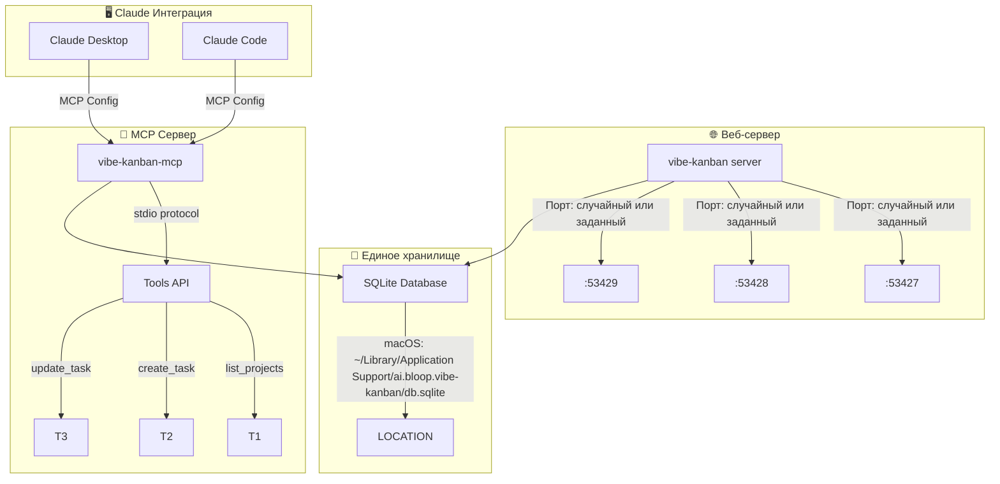
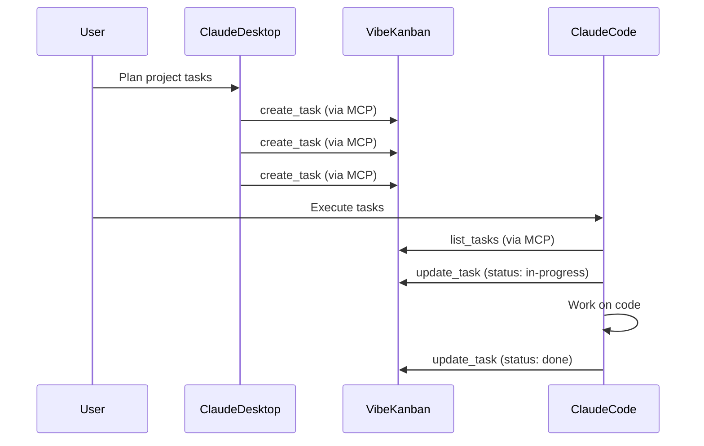

# Vibe-Kanban MCP Architecture Deep Dive

## 📋 Request Checklist
What you asked for:
- [x] Где правильно добавлять Vibe-Kanban и как работают порты/БД
- [x] Зачем добавлять в проектные конфиги если это отдельный nodejs сервер
- [x] Может ли Claude Desktop оркестрировать Claude Code через Vibe-Kanban

## 🎯 Your Original Request
> Разобраться в архитектуре Vibe-Kanban, понять как правильно его интегрировать с Claude и ответить на 3 вопроса о портах, БД и оркестрации

## 🧠 Sequential Thinking
```bash
{
  "thought": "Начинаю анализ Vibe-Kanban MCP. Сначала нужно понять архитектуру системы - что это за инструмент, как он работает, и какова его цель. Пользователь заметил, что при добавлении в разные проекты создаются инстансы на разных портах, и у него возникают вопросы о правильной архитектуре использования.",
  "thoughtNumber": 1,
  "totalThoughts": 8
},
{
  "thought": "Из README понял, что Vibe-Kanban это инструмент для оркестрации AI кодинг агентов. Он работает как централизованный сервис управления задачами, который может управлять несколькими агентами параллельно или последовательно. Ключевой момент - он использует MCP (Model Context Protocol) для интеграции. Теперь нужно понять архитектуру с портами и БД.",
  "thoughtNumber": 2,
  "totalThoughts": 8
},
{
  "thought": "Из кода сервера вижу важные детали:
1. Порт берется из BACKEND_PORT или PORT env переменных, если нет - используется 0 (автоматическое назначение свободного порта)
2. Сервер записывает фактический порт в файл через write_port_file для обнаружения
3. Есть БД которая инициализируется в DeploymentImpl
4. Сервер автоматически открывает браузер с локальным адресом
Теперь нужно понять как это связано с MCP и где хранится БД.",
  "thoughtNumber": 3,
  "totalThoughts": 8
},
{
  "thought": "Понял архитектуру:
1. Vibe-Kanban состоит из двух компонентов: основной веб-сервер (vibe-kanban) и MCP сервер (vibe-kanban-mcp)
2. Оба используют единую SQLite БД в системной директории
3. Основной сервер при запуске выбирает рандомный свободный порт (если не указан явно)
4. MCP сервер работает через stdio протокол, а не HTTP
Теперь нужно сформулировать ответы на вопросы пользователя.",
  "thoughtNumber": 4,
  "totalThoughts": 8
},
{
  "thought": "После изучения кода и архитектуры понимаю следующее:
1. Vibe-Kanban имеет два режима работы:
   - Веб-сервер (UI на случайном порту) - для управления задачами
   - MCP сервер (stdio протокол) - для интеграции с Claude/Code
2. Оба используют единую SQLite БД в системной директории
3. MCP интеграция работает через флаг --mcp при запуске
Теперь нужно сформулировать ответы на вопросы пользователя.",
  "thoughtNumber": 5,
  "totalThoughts": 8
},
{
  "thought": "Из кода MCP сервера понял последние детали:
1. MCP сервер предоставляет инструменты: list_projects, list_tasks, create_task, get_task, update_task, delete_task
2. Работает через stdio (стандартный ввод/вывод), не HTTP
3. Claude может вызывать эти инструменты когда MCP подключен
4. БД единая для всех инстансов (SQLite в системной директории)
Теперь готов сформулировать полные ответы на все три вопроса пользователя.",
  "thoughtNumber": 6,
  "totalThoughts": 7
},
{
  "thought": "Финальное понимание архитектуры Vibe-Kanban:
1. Веб-сервер запускается на случайных портах для изоляции, но все инстансы используют единую SQLite БД
2. MCP сервер работает через stdio протокол в конфиге Claude/Code
3. Архитектура позволяет оркестрацию множественных агентов через единый интерфейс
4. Claude Desktop может использовать MCP для создания/управления задачами
5. Разделение на веб UI (для человека) и MCP API (для AI агентов)
Готов дать полные ответы на все вопросы.",
  "thoughtNumber": 7,
  "totalThoughts": 7
}
```

## 🏗️ Архитектура Vibe-Kanban



## ✅ Ответ на Вопрос 1: Порты и БД

### Как работают порты:
- **Веб-сервер** (`npx vibe-kanban`) запускается на **случайном свободном порту** каждый раз
- Это **нормальное поведение** - сервер использует `port: 0` для автоматического выбора свободного порта
- Порт записывается в файл для обнаружения другими процессами
- Можно зафиксировать порт через `PORT=8080 npx vibe-kanban`

### База данных:
- **ВСЕ инстансы используют ЕДИНУЮ БД** SQLite
- Расположение БД:
  - macOS: `~/Library/Application Support/ai.bloop.vibe-kanban/db.sqlite`
  - Linux: `~/.local/share/vibe-kanban/db.sqlite`
  - Windows: `%APPDATA%\ai\bloop\vibe-kanban\db.sqlite`

### Правильная установка:

#### Глобальная установка (РЕКОМЕНДУЕТСЯ):
```json
// ~/Library/Application Support/Claude/claude_desktop_config.json
{
  "mcpServers": {
    "vibe-kanban": {
      "command": "npx",
      "args": ["-y", "vibe-kanban", "--mcp"],
      "env": {}
    }
  }
}
```

#### НЕ нужно добавлять в каждый проект!
Vibe-Kanban - это **глобальный инструмент оркестрации**, а не проектный.

## ✅ Ответ на Вопрос 2: Зачем в проектных конфигах?

### Короткий ответ: НЕ НУЖНО!

Ты прав в своих размышлениях - добавлять Vibe-Kanban в каждый `%project%/.mcp.json` **не имеет смысла**.

### Правильная архитектура:
1. **Vibe-Kanban MCP** добавляется **ТОЛЬКО глобально** в Claude Desktop/Code config
2. **Проектные MCP** (например, filesystem, database) добавляются в проектные конфиги
3. Vibe-Kanban **управляет всеми проектами** через единый интерфейс

### Разделение ответственности:
- **Глобальные MCP** (Vibe-Kanban, Perplexity, GitHub): в `~/Library/Application Support/Claude/`
- **Проектные MCP** (filesystem, local databases): в `%project%/.mcp.json`

## ✅ Ответ на Вопрос 3: Оркестрация Claude Desktop → Claude Code

### Да, это возможно и даже задумано!

Твоя догадка **абсолютно верна**. Архитектура предполагает:

### Как это работает:
1. **Claude Desktop** может создавать задачи через MCP tools:
   ```typescript
   // Claude Desktop вызывает
   create_task({
     project_id: "uuid",
     title: "Implement authentication",
     description: "Add OAuth2 login"
   })
   ```

2. **Vibe-Kanban** хранит задачи в единой БД и показывает в веб UI

3. **Claude Code** может:
   - Получать задачи через `list_tasks`
   - Работать над задачей (создавать execution attempts)
   - Обновлять статус через `update_task`

### Workflow оркестрации:


### Ключевые возможности:
- **Параллельная работа**: несколько Claude Code агентов на разных задачах
- **Последовательная работа**: chain задач с зависимостями
- **Централизованный мониторинг**: веб UI показывает прогресс всех агентов
- **Git worktrees**: каждая попытка в отдельной ветке

## 🎯 Практические рекомендации

### 1. Установка (один раз глобально):
```bash
# Добавить MCP в Claude Desktop
claude mcp add vibe-kanban -- npx -y vibe-kanban --mcp

# Или вручную в конфиг
```

### 2. Запуск веб UI (когда нужно):
```bash
# Запустить на любом порту
npx vibe-kanban

# Или на конкретном
PORT=8080 npx vibe-kanban
```

### 3. Использование:
- Claude Desktop: планирование и создание задач
- Vibe-Kanban UI: мониторинг и управление
- Claude Code: выполнение задач

## 📊 Сравнение режимов

| Аспект | Веб-сервер | MCP сервер |
|--------|------------|------------|
| **Запуск** | `npx vibe-kanban` | `npx vibe-kanban --mcp` |
| **Протокол** | HTTP | stdio |
| **Порт** | Случайный/заданный | Не использует |
| **UI** | Веб-интерфейс | Нет (API only) |
| **База данных** | SQLite (единая) | SQLite (та же) |
| **Для кого** | Человек | AI агенты |

## 🔄 Важные выводы

1. **Порты на разных запусках - это нормально**, не баг
2. **БД единая для всех** - данные синхронизированы
3. **Добавлять в проекты не нужно** - только глобально
4. **Оркестрация возможна** и это killer feature
5. **Разделение UI и API** - правильная архитектура

## 🚀 Next Steps

1. Удали Vibe-Kanban из проектных конфигов
2. Оставь только в глобальном Claude Desktop config
3. Используй веб UI для мониторинга
4. Экспериментируй с оркестрацией задач между агентами

---

*Исследование основано на анализе исходного кода Vibe-Kanban v0.0.83 и официальной документации*
