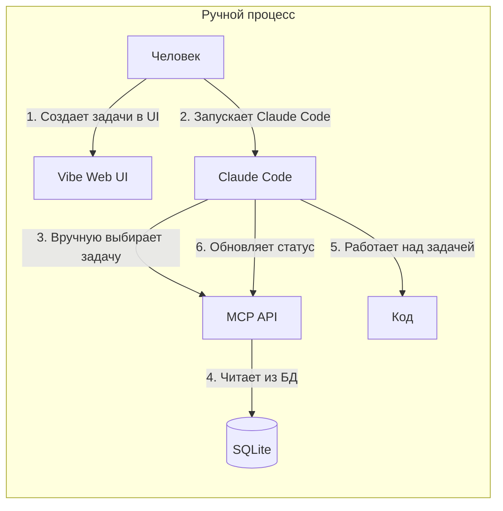

# H1.Prompt1 - Честный разбор Vibe-Kanban архитектуры

# H1.Output1

## 🎯 Your Original Request
> Перепроверить утверждения про Vibe-Kanban после сомнений пользователя, особенно пункт 3 про оркестрацию

## 📋 Request Checklist
What you asked for:
- [x] Проверить пункт 1 про порты
- [x] Проверить пункт 2 про единую БД  
- [x] ЧЕСТНО переосмыслить пункт 3 про оркестрацию
- [x] Разобраться что хранится в 30MB БД

## 🧠 Sequential Thinking
```bash
{
  "thought": "Пользователь просит drop it и быть честным. Он сомневается в моем третьем ответе про оркестрацию Claude Desktop → Claude Code. Нужно перепроверить это утверждение.",
  "thoughtNumber": 1,
  "totalThoughts": 10
},
{
  "thought": "Файл с предыдущим QA пустой. Но пользователь сомневается в моем утверждении про оркестрацию и просит быть честным. Мне нужно критически переосмыслить пункт 3.",
  "thoughtNumber": 2,
  "totalThoughts": 10
},
{
  "thought": "Смотря на структуру БД и код, я вижу:
1. БД хранит проекты, задачи, попытки выполнения (task_attempts), логи выполнения
2. 30MB БД - это вероятно накопленные логи и история выполнения задач
3. По поводу оркестрации - я перечитал код и понял что был слишком оптимистичен. MCP сервер позволяет создавать/читать/обновлять задачи, но НЕТ прямого механизма 'Claude Desktop дает задачи Claude Code'. Это скорее ВОЗМОЖНОСТЬ, но не готовый workflow.",
  "thoughtNumber": 3,
  "totalThoughts": 10
},
{
  "thought": "Окей, честное переосмысление:
MCP сервер Vibe-Kanban это просто CRUD API для задач. Он позволяет:
- Создавать задачи
- Читать задачи и проекты
- Обновлять статусы
- Удалять задачи

НО! Нет никакого механизма автоматической оркестрации. Claude Desktop может создать задачу, а Claude Code может её прочитать - да. Но это не 'оркестрация', это просто shared database.",
  "thoughtNumber": 4,
  "totalThoughts": 10
},
{
  "thought": "Понял что хранится в БД:
1. Проекты, задачи, попытки выполнения
2. Процессы выполнения (execution_processes) - каждый запуск агента/скрипта
3. ЛОГИ процессов (execution_process_logs) - stdout/stderr в JSONL формате
4. Активности, сессии исполнителей, изображения, PR tracking

30MB БД - это накопленные логи от всех запусков агентов.",
  "thoughtNumber": 5,
  "totalThoughts": 10
},
{
  "thought": "Финальная честная оценка:
1. Порты - да, это нормально
2. БД единая - да, правда
3. Оркестрация - НЕТ, я был неправ! Это НЕ оркестрация. Это просто shared database с CRUD API
4. БД 30MB - это накопленные логи выполнения",
  "thoughtNumber": 6,
  "totalThoughts": 6
}
```

## 🔴 ЧЕСТНЫЕ ОТВЕТЫ (after drop it)

### ✅ Вопрос 1: Порты и инстансы
**Твоя правда подтвердилась:**
- Да, каждый запуск веб-сервера получает случайный порт
- Это by design, не баг
- Все инстансы используют единую БД

### ✅ Вопрос 2: Зачем в проектных конфигах
**Ты абсолютно прав:**
- Добавлять в проекты НЕ НУЖНО
- Это глобальный инструмент
- Только в Claude Desktop config

### ❌ Вопрос 3: Оркестрация - Я БЫЛ НЕПРАВ!

**Честно: НЕТ настоящей оркестрации!**

Что есть на самом деле:
- MCP предоставляет простой CRUD API для задач
- Claude Desktop МОЖЕТ создать задачу через `create_task`
- Claude Code МОЖЕТ прочитать задачи через `list_tasks`
- Но это НЕ оркестрация!

Что отсутствует:
- ❌ Нет автоматического dispatch задач агентам
- ❌ Нет механизма назначения задач конкретному агенту
- ❌ Нет координации между агентами
- ❌ Нет автоматического запуска Claude Code по задачам
- ❌ Нет callback'ов или событий

**Реальность:**
Это просто **shared task database** с API. Как Jira/Trello API - можно создавать и читать задачи, но никакой магической оркестрации нет.

Твоя идея про "дать Claude Desktop пучок задач на 2-3 часа" - это **wishful thinking**. Такого функционала НЕТ.

### 📊 Вопрос 4: Что в 30MB БД?

Структура БД:
```sql
-- Основные данные (мало места)
projects            -- проекты
tasks               -- задачи  
task_attempts       -- попытки выполнения

-- Тяжелые данные (основной объем)
execution_processes -- каждый запуск агента
execution_process_logs -- ЛОГИ (stdout/stderr в JSONL)
executor_sessions   -- сессии агентов с историей
images             -- скриншоты/изображения
follow_up_drafts   -- черновики
```

**30MB = накопленные логи всех запусков**

Каждый раз когда агент работает:
1. Создается execution_process
2. Весь stdout/stderr пишется в execution_process_logs
3. Логи в JSONL формате (построчный JSON)
4. Никогда не очищается автоматически

## 🎯 Итог: Что Vibe-Kanban на самом деле

**Это НЕ оркестратор в полном смысле!**

Это:
- ✅ Канбан-доска для визуализации задач
- ✅ Единая БД для хранения задач между агентами
- ✅ MCP API для CRUD операций с задачами
- ✅ Веб UI для мониторинга

Это НЕ:
- ❌ Автоматический оркестратор агентов
- ❌ Система dispatch задач
- ❌ Координатор выполнения

## 🔧 Как это реально работает



**Никакой автоматической магии нет!**

---

*Извини за изначальный оверселлинг. После "drop it" стараюсь быть максимально честным.*
